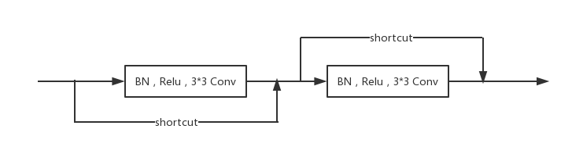

# VesselNet
A DenseBlock-Unet for Retinal Blood Vessel Segmentation

## DenseBlock Unet
Inspired by DenseNet and @orobix/retina-unet,I modify the Conv2d to DenseBlock and also change the file struct.

## Mertic
With data argumentation and DenseBlock-Unet
Results on DRIVE database:

|Methods|AUC ROC on DRIVE|
|-:|-:|
|Liskowski|0.9790|
|Retina-Unet|0.9790|
|VesselNet|0.9793|

## setup 
requirements:
- python3+
- keras2.0+
- theano0.9+
- opencv3+
- matplotlib

Download [training data][1] and Extract to DataSet folder

Download [pretrain model][2] and Extract to DataSet folder

## test your own image
to test your own image,put the to TestFolder/origin,and change the img_type of predict settings in configurations.txt,run xPredict.py to get your result.

[1]: https://drive.google.com/open?id=1fDlnqeuGlX93lUkXEEWcImSFoIufLhRe
[2]: https://drive.google.com/open?id=1VVQveyxHIB4OT74Lk4M86GLddSupIZKO
